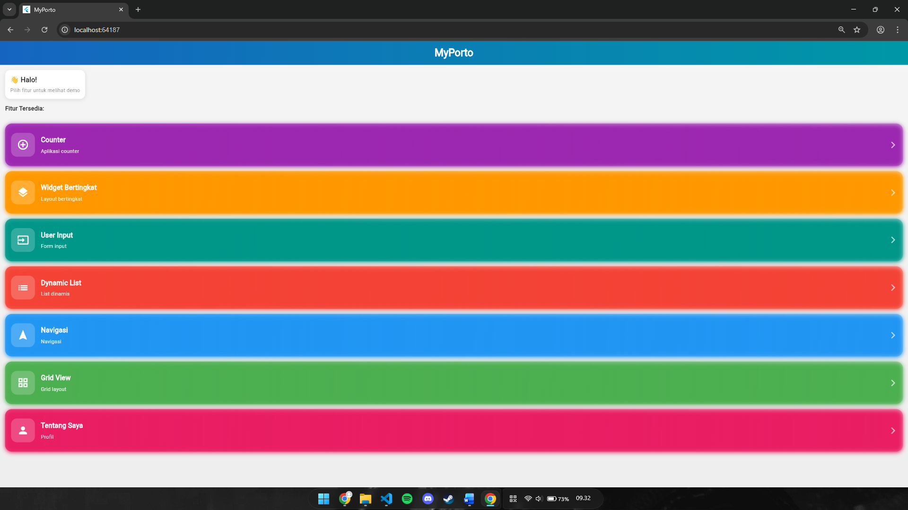
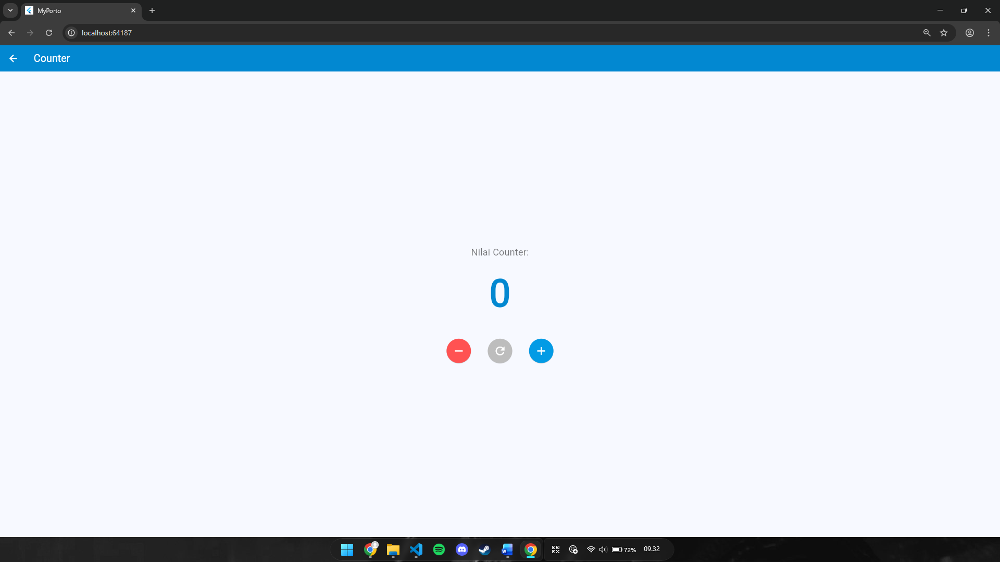

# MyPorto - UTS Praktikum Aplikasi Bergerak

Aplikasi portofolio Flutter yang menampilkan berbagai demo widget dan fitur untuk UTS Praktikum Pemrograman Aplikasi Bergerak.

## Fitur

- **Counter**: Demo aplikasi penghitung sederhana
- **Widget Bertingkat**: Contoh layout widget bertingkat dengan gambar
- **User Input**: Form input untuk data pengguna
- **Dynamic List**: Daftar dinamis dengan data
- **Navigasi**: Sistem navigasi antar halaman
- **Grid View**: Tampilan grid untuk item-item
- **Tentang Saya**: Halaman profil dengan foto

## Teknologi

- Flutter
- Dart
- Material Design

## Cara Menjalankan

1. Pastikan Flutter sudah terinstall
2. Clone repository ini
3. Jalankan `flutter pub get`
4. Jalankan `flutter run`

## Struktur Proyek

```
lib/
├── main.dart
├── pages/
│   ├── counter_page.dart
│   ├── dashboard_page.dart
│   ├── dynamic_list_page.dart
│   ├── grid_view_page.dart
│   ├── navigasi_sederhana_page.dart
│   ├── tentang_saya_page.dart
│   ├── user_input_page.dart
│   └── widget_bertingkat_page.dart
└── widgets/
```

## Screenshot

Berikut beberapa tampilan aplikasi yang disediakan di folder `screenshots/`:

- `screenshots/Dashboard.png`
- `screenshots/user_input.png`
- `screenshots/dynamic_list.png`
- `screenshots/navigasi_sederhana.png`
- `screenshots/tentang_saya.png`
- `screenshots/widget_bertingkat.png`
- `screenshots/Counter.png`
- `screenshots/grid_view.png`
- `screenshots/halaman_detail.png`







## Lisensi

Proyek ini dibuat untuk keperluan akademik UTS Praktikum.
